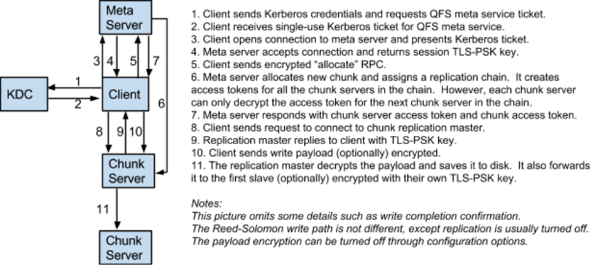

# QFS Kerberos Security Design

## Introduction

The security scope includes the following concepts with respect to the network
communication between hosts in the distributed QFS file system:

1. Authentication
2. Authorization
3. Integrity
4. Confidentiality
5. Authentication delegation

## Authentication

Authentication is attained by using Kerberos 5 system, asymmetric key
cryptography with X509 certificates, or TLS-PSK. TLS-PSK is used to attain
Integrity and Confidentiality with Kerberos and QFS authentication delegation
methods.

1. Depending on the specifics of the particular run time and environment, and
   the desired protection level, Authentication, Integrity, and Confidentiality
   can be selected by the QFS configuration.
2. The minimum security level is authentication only between individual chunk
   servers, and between chunk servers and the clients. This level assumes that
   the network communication between QFS client and QFS nodes cannot be tampered
   with (no man in the middle attack is possible), or observed by a 3rd party.
   This could be a reasonable assumption for a "private" cluster network.
3. Integrity and Confidentiality might be turned off for communications between
   client and chunk servers, as well as between chunk servers, in order to
   reduce CPU utilization. With authentication enabled, turning off integrity
   and confidentiality between the client and meta server is not
   supported.
4. It should be noted that Kerberos 5 system relies on the host file system
   access control and therefore any unauthorized unrestricted (root) access to
   one of the hosts in the Kerberos 5 system would constitute a major security
   breach, and can void authentication, integrity, and confidentiality. In this
   respect QFS security design is not different from any other Kerberos 5
   ("kerberized") service designs. For this reason and to enforce local (host)
   file system access control the map / reduce tasks need to run under
   [delegated] user account started the job.
5. Typically meta and chunk servers each will have their own unique (host
   specific) Kerberos 5 service keys used for mutual authentication between QFS
   client, meta and chunk servers, and, in turn, if configured, to ensure
   integrity and confidentiality. Customarily such service keys are stored in
   the Kerberos 5 KDC database, and in the corresponding host specific "key tab"
   files. The distinct chunk server Kerberos principals are required for
   “revocation” / "blacklisting" to work.
6. With X509 authentication method typically meta server and chunk servers each
   have their own X509 certificate with distinct “common name”, issued by
   typically the same trusted “authority”, and the corresponding private key.
   The distinct common names are required for “revocation” / “blacklisting” to
   work.
7. QFS uses standard Kerberos 5 mechanisms to obtain the necessary Kerberos 5
   tickets. For example "kinit" with user password, or kinit with "key tab" if
   the client is running on behalf of some other "service".
8. Depending on the configuration, the chunk servers and the meta server perform
   Kerberos 5 mutual authentication, or X509 SSL/TLS mutual authentication.
   TLS/PSK with a single fixed “secret” key is supported, but is not
   recommended, as with this method unique server identity (other than the
   shared “secret” key) is not supported and “revocation” / “blacklisting”
   cannot work.
9. Each chunk server creates and periodically updates the QFS keys, and
   communicates the newly created key to the meta server. The meta server uses
   the most recently communicated key to create QFS chunk server authentication
   and chunk access tokens. As a consequence the tokens can be used only with
   one chunk server.
10. The original ("job launch") client running under user account, and meta
    server can use Kerberos 5 or X509 mutual authentication. The map / reduce job
    launch client obtains the QFS authentication delegation token and forwards
    this token to the job tracker.
11. QFS meta server creates QFS authentication delegation tokens that can be
    forwarded to QFS clients and / or other parties to act on behalf
    (impersonate) a user with QFS.
12. By default only clients authenticated with the Kerberos 5 or X509 mechanisms
    are allowed to request QFS authentication delegation tokens.
13. QFS meta server creates QFS chunk server access tokens.
14. The meta server performs mutual authentication with QFS authentication
    delegation tokens.
15. The chunk servers only perform mutual client authentication with QFS chunk
    server access tokens.
16. Chunk server to chunk server authentication uses QFS keys created by the
    destination chunk server and communicated to the meta server.
17. Map / reduce tasks use QFS authentication delegation tokens to authenticate
    with the meta server.
18. Job tracker performs Kerberos 5 or X509 mutual authentication with the meta
    server.
19. Task tracker performs Kerberos 5 mutual authentication with the job tracker.
20. Alternatively job tracker and task tracker can use Kerberos 5 mutual
    authentication with the QFS meta server and use QFS to establish a secure
    communication channel between them. For example, the job tracker, sort
    controller, and sort master can use QFS to establish TLS-PSK shared keys.
    Generic support to establish shared secrets between the services could be
    added to the meta server in the form of drop boxes stored entirely in
    metadata. However, this is currently not implemented. It is not clear
    how/whether this would work with respect to metadata backups.
21. All file system components including meta server, chunk servers, and QFS
    clients enforce the level of protection required by the configuration to
    combat against protection level downgrade attacks. For example if the
    initiator (client) and / or the responder (server) require mutual
    authentication, confidentiality, and integrity to be enabled, initiator and /
    or responder will declare a communication failure, unless all of these
    requirements are fulfilled.

## Authorization

The existing UNIX like QFS file access permissions are used for Authorization
purposes.

1. QFS meta server performs authorization for the user name obtained as a result
   of the QFS client and the meta server mutual authentication, or QFS user ID
   obtained from the QFS delegation token.
2. Effective user name is derived from Kerberos 5 principal, client’s X509
   certificate common name, or from QFS user ID stored in QFS delegation token.
   The meta server is assigned its own specific Kerberos ”service" key, and/or
   X509 certificate, and X509 certificates of the trusted authorities. The
   client obtains the corresponding Kerberos 5 service ticket, or uses
   conventional X509 certificate verification in order to complete the mutual
   authentication with the meta server.
3. Effective group. Kerberos 5, and X509 certificate has no concept of groups,
   therefore a different mechanism must be used to establish QFS group
   membership. The meta server obtains group membership from the standard UNIX
   group database. Specifically, the "local" database (/etc/groups) on the meta
   server host. If required, in the future, a different group membership
   mechanism can be implemented.
4. The meta server uses the meta server host’s UNIX user and group databases to
   obtain the mapping of user and group names to user and group ID. The mapping
   is required due to absence of user and group ID concepts in Kerberos 5 client
   principal, and client’s X509 certificate. The primary reason to use such a
   mapping is to reduce space requirements for storing and communicating i-node
   (files and directories) attributes. The secondary reason is to maintain
   backward compatibility with the previous meta server checkpoint and
   transaction log versions by providing initial user and group IDs to names
   mapping.
5. With authentication enabled the QFS client library uses the same user and
   group names to numeric IDs mapping as the meta server by maintaining a cached
   view of the meta server’s respective tables. To maintain backward
   compatibility the client host’s local user and group database is used to map
   numeric IDs to names with no authentication. The QFS FUSE module always uses
   the same user and group IDs as the meta server.

## Delegation

QFS authentication delegation and access tokens.

1. QFS authentication delegation token is a tuple:  { User ID, Random Sequence,
   QFS Key ID, Flags, Issued Time, Expiration Time Delta, Signature }. The
   signature is HMAC SHA-1 of all fields, except the signature fields itself,
   created by using the QFS Key that corresponds to the QFS Key ID. The HMAC
   SHA-1 signature computation can optionally include any implicit “subject”
   field. The implicit subject field is not part of the token. Presently
   implicit subject field is used with chunk access tokens, where the subject is
   QFS chunk ID, or QFS write ID.
2. The meta and chunk servers create and store in memory QFS Key ID and the
   corresponding QFS Keys as a dictionary of key value pairs: Key = {QFS Key ID}
   Value = { QFS Key }. QFS Key consists of randomly generated 384 bits (48
   bytes), and QFS Key ID consists of randomly generated 8 bytes (64 bit).
   Optionally the meta server can be configured to keep the copy of all
   currently valid meta server keys and the corresponding IDs on disk to allow
   keys to persist across meta server restarts. The meta and chunk servers
   periodically generate new and expire existing QFS Keys. The expired keys are
   discarded. The QFS Key lifetime implicitly defines the QFS Delegation token
   renewal interval, and QFS Access tokens maximum expiration time. The key
   lifetime cannot be lower than QFS lease expiration time — 5 minutes.
3. The QFS delegation tokens must be renewed before the corresponding QFS Key
   expires. The meta server renews the token by replacing the Key ID and
   re-computing the Signature field with the current key; all other token fields
   remain the same. Only clients authenticated with Kerberos 5 or X509
   authentication methods are allowed to renew the delegation tokens.
4. Delegation token cancellation. The meta server maintains a set of all
   currently valid cancelled tokens. The token Key-ID and Signature fields are
   not stored in this set entry. Doing so allows a single entry to match all
   possible renewed token variants created with different QFS Key and QFS Key
   IDs. To cancel a delegation token the default configuration requires the
   client to be authenticated with Kerberos 5 or X509 authentication methods and
   present a valid token to be cancelled along with the token’s session key.
5. The meta server can be configured with the list of user or group names that
   are allowed to renew and cancel delegation tokens that were issued to users
   other than the currently authenticated user. For example, the configuration
   might allow job tracker [user] to renew and cancel delegation tokens that
   were issued to users different than job tracker user.
6. The delegation and access tokens, along with the corresponding QFS Key are
   used to create the QFS authenticated session key. The session key is created
   by computing SHA-384 over the QFS Token and QFS Key concatenation.
7. The meta server computes and communicates to the client the QFS session key
   along with the QFS delegation token.
8. The Delegation Token and Session Key are used with TLS PSK authentication.
   The QFS client uses session key as a shared secret, and passes the token to
   the meta server in the TLS client hello message.
9. Chunk server access tokens only differ from the delegation token in the
   Flags field value. The chunk server access tokens and the corresponding
   session keys are used by the client or other chunk servers acting as client
   to authenticate with the chunk server and, unless explicitly disabled by
   configuration, attain communication secrecy and integrity.
10. Chunk access token differs from the delegation token in the Flags field
    value. The token’s signature “includes” implicit chunk or write ID. The
    chunk access tokens are used to authorize chunk access with the chunk
    server, with the minimum communication security and integrity levels
    configured on the client and meta server.
11. A number of Flags bits are currently reserved for future extensions.

## Chunk Access

Authentication and authorization with chunk server and chunk access tokens.

1. The meta server creates and returns to the QFS client chunk server and chunk
   access tokens, and chunk server access session keys at the time of the chunk
   creation, or read lease acquisition, or renewal. In order to access chunks
   the QFS client (or chunk server acting as a client) must be authenticated
   with the chunk server by using valid chunk server access token, and present
   valid chunk access token with user ID that matches the user ID in the chunk
   access token. The token’s chunk access (read or write) permissions, and
   communication security and integrity must match requested chunk access mode,
   and communication (client connection) security and integrity level.
2. When chunk is created or opened for write (“allocated” in QFS terms) the
   chunk server access and chunk access tokens are communicated by the meta
   server to the chunk server at the head of the synchronous replication chain,
   along with the chunk write lease. This is needed in order to allow to
   establish synchronous replication chain. The chunk server session keys for
   the chunk servers past the head of the chain are encrypted using the most
   recent QFS Key of the corresponding chunk server.
3. The client can request chunk server access and chunk access token from the
   chunk server at the head of the replication chain, if the access tokens
   issued by the meta server are about to expire. The chunk server will create
   the tokens as long as the chunk write lease remains valid. The chunk
   authorization (file permissions) are re-evaluated during periodic (every five
   minutes) chunk write lease renewals performed by the chunk server at the head
   of the synchronous replication chain.
4. The chunk server acting as recovery client is authenticated by the meta
   server using same delegation token and session key mechanism that is used for
   the client authentication delegation. The chunk server and chunk access
   tokens used for re-replication and recovery have “chunk server access” flag
   set. The token’s user ID is set to a value derived by hashing the chunk
   server’s clients listener ip and port.

## Implementation Considerations

1. Using higher level SASL API was considered. SASL presents more generic API,
   and has a generic enough "plugin" system that allows adding possible new
   "security" mechanisms. The considered Cyrus SASL implementation adds
   noticeable cpu overhead due to an increased number of memory allocations,
   buffer copies, and plugin selection with dlopen() / dlsym() on every server
   context creation (accept). The overhead might be more noticeable with
   integrity and confidentiality enabled, as the initial authentication of the
   existing Kerberos 5 implementation on CentOS 5 does not seem to be very cpu
   efficient by itself. Performance testing showed 0.2 ms per server
   authentication context establishment call with a single thread being cpu
   bound on the modern hardware. (The time per call seems to noticeably
   increase with more parallel threads, possibly due to concurrency limiting
   effects of using /proc/urandom.) On the other hand, the existing and possibly
   future SASL plugging authentication mechanism will unlikely be useful or
   easily adoptable / switchable for the task at hand. For these reasons it is
   hard to recommend using SASL on top of GSSAPI.
2. TLS Kerberos 5 ciphers were also considered. One problem with the TLS
   Kerberos 5 ciphers is that the existing standard / RFC and openssl
   implementation do not include AES ciphers. With AES-NI instruction set AES
   encryption looks very attractive: 128 bit AES outperforms RC4 cipher with 770
   vs 700 MB/s according to openssl speed. Due to the benchmark likely being
   completely cache resident, and given the fact that HMAC-SHA1 speed is
   noticeably lower (512 MB/s), the real world speed will differ significantly,
   nevertheless the cryptographic strength of 128 bit AES cipher presently
   considered much higher than the strength of RC4. The other, perhaps the main,
   problem is that the existing openssl implementation has no support for
   kerberos tickets encrypted with AES. While it is relatively simple to patch
   openssl to support AES encrypted tickets, relying on such a patch for all
   supported platforms would increase code maintenance overhead, and decrease
   code "portability" and adoption.
3. Initial prototyping and studying the example code suggested that the
   increase in complexity by using Kerberos 5 API directly instead of using
   GSSAPI is fairly small. The practical implications of the differences between
   the two popular Kerberos implementations (MIT and Heimdal) for the purpose of
   QFS implementation are fairly small, and it is relatively straightforward to
   support both. On the other hand, GSSAPI layer does does not seem optimal and
   provides limited access to the underlying Kerberos library.
4. In order to reduce chunk server and client cpu utilization, secrecy and
   integrity of client and chunk server communications can be turned off by
   changing the meta server configuration. In this case the TLS layer is
   shutdown, and bypassed, after the connection is established and
   authenticated. In such case after the authentication finishes the existing
   generic QFS network IO code path is used with no modifications.
5. With Kerberos 5 authentication the client, and/or chunk server
   authenticating with the meta server, issues standard AP_REQ messages to the
   meta server. The meta server validates AP_REQ, obtains a kerberos principal,
   and then validates derived from Kerberos principal user name. The session key
   in the Kerberos ticket is used as the shared key with TLS-PSK exchange. The
   Kerberos session key is retrieved from the Kerberos 5 ticket by the service
   (meta server) and the client.
6. Backward compatibility. Only QFS client library and the corresponding
   "client" tools / utilities will maintain backward compatibility with the
   previous QFS versions with no authentication support. For example one of the
   existing meta server RPCs is used by the client to detect authentication
   support. The status code of LOOKUP RPC performed on root directory is used
   for this purpose.
7. To reduce meta server cpu utilization the number of client connections to
   the meta server from a single client is reduced from 2 to 1, at the cost of a
   minor complexity increase.
8. Kerberos 5 infrastructure / KDC load and performance consideration.
   Services', for example, chunk servers', service tickets should have
   reasonably long lifetimes in order to keep KDC load at a reasonable level.
   Moreover, the service tickets on a large enough cluster might need to be
   obtained in a coordinated / staggered fashion in order to keep KDC peak load
   at a reasonable level. Alternatively, X509 authentication method can be used
   for chunk server authentication to the meta server instead.

## Examples

Write Path with Replication

### Details

- **Step 3.** The client sends AP_REQ Kerberos message, as a payload of the QFS
  authenticate RPC.
- **Step 4.** Meta server returns authentication RPC reply, that says "use
  TLS/PSK," and expects to receive TLS client hello from the client. The client
  responds with client hello, then the meta server and the client complete
  TLS/PSK handshake. Meta server and the client both use kerberos session key as
  shared secret to perform TLS/PSK handshake. The "use TLS/PSK" reply is
  essentially an "empty" reply. In other words if the reply says "don't use
  TLS/PSK,” and doesn't present AP_REP message, the client will fail the
  authentication, in order to prevent man-in-the-middle downgrade attack.
- **Step 5.** All the subsequent RPCs are sent via the established TLS
  connection/channel: authenticated, encrypted, and integrity protected.
- **Step 9.** The replication master and the client perform standard TLS/PSK
  handshake (the same handshake is used with kerberos meta server authentication
  and delegation). Openssl does this handshake. The handshake is bidirectional:
  =>client hello, <=server hello, =>client key exchange + client finished,
  <=server finished). The client uses token's session key that it obtained from
  the meta server as PSK secret, the chunk server uses its QFS Key and the token
  to compute the same key -- shared secret.
- **Step 10.** The client uses the TLS channel (connection) established in 9 to
  communicate with the chunk server. The client sends the write payload along
  with the chunk access token to the write master.
- **Step 11.** The master establishes connection with the "slave", and performs
  TLS/PSK authentication using the key it received from the meta server in 6.
  The master forwards the write data and chunk server access tokens along with
  the corresponding encrypted session keys, and chunk access tokens, for the
  other chunk servers.

Note: QFS does not "invent" a new authentication method, but uses standard
TLS/PSK for all communications, except when standard TLS X509 authentication
method is used.
