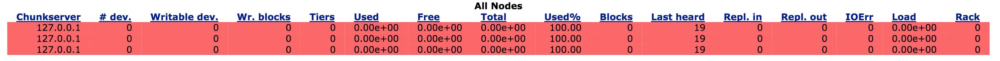
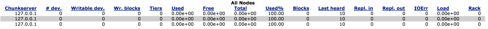

# QFS on S3 Guide

Starting with version 1.2.0, QFS provides the ability to create a filesystem
instance that is backed by Amazon S3. This guide documents the instructions for
how to enable Amazon S3 support on QFS. For a general discussion of existing
features, design and a performance comparison with EMRFS, we encourage you to read
[the blog post](https://www.quantcast.com/blog/quantcast-file-system-on-amazon-s3/).

## For the Impatient

[sample_setup.py](https://github.com/quantcast/qfs/blob/master/examples/sampleservers/sample_setup.py) has been updated, so that you can quickly spin up a local
QFS on S3 instance and try it out. Before invoking the script, first,
uncomment and fill in the following fields in [sample_setup.cfg](https://github.com/quantcast/qfs/blob/master/examples/sampleservers/sample_setup.cfg)
file:

```properties
# S3 properties: for S3 support, uncomment and 
# set the correct values depending on your AWS S3 bucket 
# and IAM settings. 
bucketName = <myBucketName> 
accessKeyId = <myAccessKeyId> 
secretAccessKey = <mySecretAccessKey>
```

Once this is done, run the following command:

```sh
"$QFS_SOURCE_DIR"/examples/sampleservers/sample_setup.py --object-store -a install
```

If the remaining fields on sample_setup.cfg are left unchanged, this creates
an QFS instance that consists of one metaserver and three chunkservers
(serving as S3 access proxies) all running on the localhost. If you want to
take a look at the generated metaserver and chunkserver configuration files,
please see the following files: ~/qfsbase/meta/conf/MetaServer.prp and ~/qfsbase/chunk1/conf/ChunkServer.prp.

Next, use the existing QFS tool and run the following command to copy
a text file under the root directory of the QFS instance that we just created:

```sh
"$QFS_BUILD_DIR"/bin/tools/cptoqfs -s 127.0.0.1 -p 20000 -d TestFile.txt -k /TestFile.txt
```

Alternatively, you can run the binary of [qfssample_main.cc](https://github.com/quantcast/qfs/blob/master/examples/cc/qfssample_main.cc),
which performs various operations against a given filesystem instance including file creation, read, write, rename and deletion.

```sh
"$QFS_BUILD_DIR"/bin/examples/qfssample -s localhost -p 20000
```

Once done testing, you can bring down the QFS instance with the following command:

```sh
"$QFS_SOURCE_DIR"/examples/sampleservers/sample_setup.py --object-store -a uninstall 
```

## Enabling S3 Support on QFS

Next, we want to show how to enable Amazon S3 support on an
QFS instance by modifying chunkserver and metaserver configuration files manually.
The changes for each is presented below.

### chunkserver configuration changes

1. *Add and set [chunkServer.objectDir](https://github.com/quantcast/qfs/blob/master/conf/ChunkServer.prp#L310)
parameter.* chunkServer.objectDir is similar to chunkServer.chunkDir parameter.
The difference is tha instead of pointing to an existing directory in
chunkserver, it points to an hypothetical directory in which chunkservers can
place S3 files. For example, the corresponding line for this parameter can read:

   ```properties
   chunkServer.objectDir = s3://myfirstbucket.
   ```

   In the example, the part after "s3://" in the specified object directory,
i.e. "myfirstbucket." (including the . sign at the end), is treated as the
configuration suffix. Metaserver associates the configuration suffix with an S3
bucket name and AWS credentials to access the given bucket. Corresponding
metaserver configuration changes are described in the next section. This is the
only required parameter that needs to be set up in chunkserver configuration
file for S3 support. For the optional S3 parameters in chunkserver configuration
file, [please visit](https://github.com/quantcast/qfs/blob/master/conf/ChunkServer.prp#L290).

   \* **One can specify multiple object directories with chunkServer.objectDir parameter.
Please refer to [Specifying Multiple Object Store Directories](#specifying-multiple-object-store-directories) section in this guide for more details.**

### metaserver configuration changes

1. *Add and set [metaServer.objectStoreEnabled](https://github.com/quantcast/qfs/blob/master/conf/MetaServer.prp#L1200) parameter.*

   This parameter enables object store in metaserver. For example:

   ```properties
   metaServer.objectStoreEnabled = 1
   ```

2. *For each configuration suffix specified in the chunkserver configuration file, specify
the [chunkServer.diskQueue.&lt;object-store-directory-prefix&gt;bucketName](https://github.com/quantcast/qfs/blob/master/conf/MetaServer.prp#L1245),
[chunkServer.diskQueue.&lt;object-store-directory-prefix&gt;accessKeyId](https://github.com/quantcast/qfs/blob/master/conf/MetaServer.prp#L1248),
and [chunkServer.diskQueue.&lt;object-store-directory-prefix&gt;secretAccessKey](https://github.com/quantcast/qfs/blob/master/conf/MetaServer.prp#L1251)
parameters.*

   For example, using the same object directory specified in chunkserver configuration example, one can have:

   ```properties
   metaServer.diskQueue.myfirstbucket.bucketName = <my-first-bucket-name> 
   metaServer.diskQueue.myfirstbucket.accessKeyId = <access-key-ID> 
   metaServer.diskQueue.myfirstbucket.secretAccessKey  = <secret-access-key> 
   ```

   The actual values for &lt;my-first-bucket-name&gt;, &lt;access-key-ID&gt; and
&lt;secret-access-key&gt; depend on the existing S3 bucket and the IAM
(Identity & Access Management) settings of the corresponding AWS account.

3. *(optional) Add and set [metaServer.maxReplicasPerFile](https://github.com/quantcast/qfs/blob/master/conf/MetaServer.prp#L297)
and [metaServer.maxReplicasPerRSFile](https://github.com/quantcast/qfs/blob/master/conf/MetaServer.prp#L302) parameters.*

   These two parameters tell metaserver to store all files in S3 object store,
regardless of the file create parameters sent by QFS clients. For example:

   ```properties
   metaServer.maxReplicasPerFile = 0
   metaServer.maxReplicasPerRSFile = 0
   ```

   These parameters are optional, and typically used in the case where
QFS instance is configured with S3 storage only (in mixed mode, where
QFS uses both S3 and disk storage, these parameters should not be used).
In their absence, QFS clients need to specifically indicate each time
that a file is to be stored in S3 object store. For instance, to copy
a file in S3 object store, one would need to append “-r 0” argument to
cptoqfs call:

   ```sh
   "$QFS_BUILD_DIR"/bin/tools/cptoqfs -s 127.0.0.1 -p 20000 -d TestFile.txt -k /TestFile.txt -r 0
   ```

   “-r 0” tells the metaserver to use 0 replicas for TestFile.txt and that
internally is mapped to S3 object store by the metaserver. If “-r 0” were omitted,
the default file creation parameters would be used, which in turn may or
may not succeed depending on chunkserver configurations.

4. *(optional) Add and set metaServer.pingDoNotShow*

   Without this parameter, clicking on the “Meta Server Configuration” tab in QFS
web UI reveals all metaserver configuration parameters including AWS credentials
used to access the specified bucket. One can prevent this by setting
this parameter like the following:

   ```properties
   metaServer.pingDoNotShow = chunkServer.diskQueue.myfirstbucket.accessKeyId chunkServer.diskQueue.myfirstbucket.secretAccessKey
   ```

   For the other optional S3 parameters in the metaserver configuration file, [please visit](https://github.com/quantcast/qfs/blob/master/conf/MetaServer.prp#L1196).

That is it! Once these parameters are set, one can start up the QFS metaserver and
chunkservers the same way he/she would do for a regular QFS instance.

## Web UI Changes

The following figure shows how the chunkservers (access proxies), which are configured with having
no chunk directories, but object directories, of a local QFS on S3 instance are displayed in QFS web UI:



By default, QFS web UI displays the chunkservers that do not have any associated
chunk directories on local storage in light red color. Although this helps identifying
the chunkservers with chunk directory problems easily for regular QFS instance with no
S3 support, it can be confusing in cases where chunk directory parameter
([chunkServer.chunkDir](https://github.com/quantcast/qfs/blob/master/conf/ChunkServer.prp#L69))
is not specified intentionally and instead they are used as access proxies only.
To override the default behaviour, one can set the
[webServer.objectStoreMode](https://github.com/quantcast/qfs/blob/master/webui/server.conf#L37) parameter web
in the web UI configuration file. If enabled, web UI makes the assumption that the
user intends to use the chunkservers as S3 access proxy only, and display them regularly:



## Specifying Multiple Object Store Directories

QFS allows users to specify more than one object store directories in the chunkserver
configuration file and then associate each object store directory with
a different S3 bucket along with the IAM configurations to access the bucket.
One crucial point here is that different object store directories must be assigned
to different storage tiers. Otherwise, QFS returns an error for object store reads
and writes until the configuration is fixed. For more details,
[please see here](https://github.com/quantcast/qfs/blob/master/conf/ChunkServer.prp#L296).

The following example illustrates how chunkserver and metaserver configuration
files can be modified to make use of multiple object store directories.

*chunkserver configuration file:*

```properties
chunkServer.objectDir = s3://myfirstbucket. s3://mysecondbucket.
```

*metaserver configuration file:*

```properties
chunkServer.objecStorageTierPrefixes =  s3://mysecondbucket. 14 # by default, an object store directory is assigned to tier 15, so we skip specifying the tier for "myfirstbucket". 
chunkServer.diskQueue.myfirstbucket.bucketName = <my-first-bucket-name> 
chunkServer.diskQueue.myfirstbucket.accessKeyId = <access-key-ID> 
chunkServer.diskQueue.myfirstbucket.secretAccessKey  = <secret-access-key> 
chunkServer.diskQueue.mysecondbucket.bucketName = <my-second-bucket-name> 
chunkServer.diskQueue.mysecondbucket.accessKeyId = <access-key-ID> 
chunkServer.diskQueue.mysecondbucket.secretAccessKey  = <secret-access-key> 
```

## Using Amazon S3 and Chunkserver Local Storage Together

QFS offers the flexibility to either create a filesystem instance that can solely
read/write from/to Amazon S3, or to use a mixed mode in which both Amazon S3 and
local storage resources are made use of for file storage. Which mode is currently
being used by a QFS instance depends on the co-existence of chunkServer.chunkDir and
chunkServer.objectDir parameters in chunkserver configuration file. Specification
of both parameters allows the metaserver to use both resources (S3 and local)
for file storage/retrieval. On the other hand, if chunkServer.chunkDir is omitted,
the filesystem instance will be backed by Amazon S3 only.

## Further Help and Suggestions

If you can not find the information you are looking for in this document,
or have suggestions for how the guide can be improved, please reach out to us.


